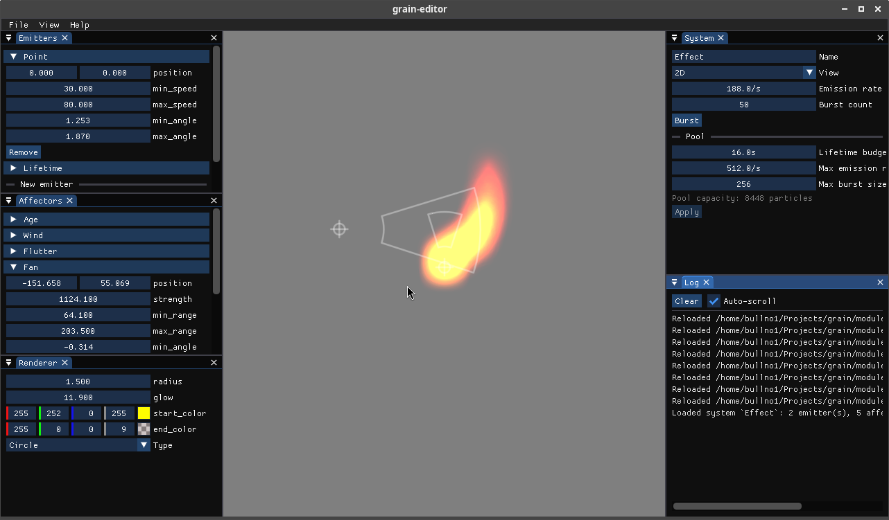

# grain

[](https://github.com/bullno1/grain/actions/workflows/build.yml)

Grain is a GPU-driven composable particle system with its own DSL.

It is designed to be used with [Cute Framework](https://github.com/RandyGaul/cute_framework).



# Building

`./bootstrap` to pull all dependencies.

## Linux

```
cmd/linux/build
```

## Windows

```
cmd/win/prepare.bat
cmd/win/build.bat
```

## Web

```
cmd/web/build
```

# Concepts

To procedurally define a particle system, we need to create several modules.
A module is a self-contained compilation unit with:

* A kind declaration to state what the module is and name it: `Emitter(Point)`, `Affector(Gravity)` or `Renderer(Quad)`.
  A module name has to be unique within its kind (the kinds are explained below).
* A `Requires` block listing which particle attributes it needs.
  An "attribute" is what describes an individual particle.
  For example: position, velocity...
* A `Params` block listing the kind of parameters that can be used to tweak the module.
  A "parameter" is what describes a module, not a particle.
  For example, in a `Gravity` module, the gravity constant is a module parameter.

  A parameter can be annotated with `@decorator(...)` lines such as `@range(min = 0, step = 0.1)` or `@color`.
* An optional `Samplers` block listing the textures the module reads.
  Each declaration is exactly `sampler2D name;`.
  An emitter might sample a noise or property-curve texture, an affector a vector field, a renderer the particle's image.

  Inside `process` the sampler is referenced by its name, and a companion `vec4 name_uvrect` holds the bound texture's UV rect, `(0,0)-(1,1)`, for a raw texture, or the sprite's region inside its atlas.
  `atlas_uv(name_uvrect, uv)` maps a unit UV into that rect.
  For pixel art, `texture_smooth(name, name_uvrect, uv)` samples the same way but keeps texels crisp under a linear filter (a fragment-stage port of Cute Framework's `smooth_uv`, which is also available as `smooth_uv(uv, texture_size)` and `smooth_uv(uv, name_uvrect, texture_size)`).

  Textures are bound per pool with `grain_set_texture` (raw `CF_Texture` plus optional UV rect and `CF_Sampler`)
  For a sprite, use: `grain_set_sprite`.
  Every system in a pool samples the same textures; per-system variation comes from the UV rect.
  An unbound slot samples an opaque white fallback.
* A GLSL function with the signature `void process(inout ParticleAttrs particle, ModuleParams params, Ctx ctx)`.
  It will be run on the GPU for each particle.

  * `ParticleAttrs` is a struct containing all the fields in the `Requires` block.
  * `ModuleParams` is a struct containing all the fields in the `Params` block.
  * `Ctx` is a system defined struct with timing informations such as delta time or elapsed time,
    plus `transform`: the system's local-to-world matrix (`mat4`), set from C with `grain_set_transform`
    and identity by default.
    The `to_world(p)` and `to_world_dir(d)` builtins apply it to points and directions respectively,
    with `vec2` overloads working in the z = 0 plane.

    The transform is instance state rather than a parameter, so it is not saved in blueprints, and the modules decide where it applies:

    * World-space effects apply it at emission, e.g. `particle.position = to_world(params.position)`,
      and positional affectors anchor with `to_world(params.position)`.
      Moving the system leaves already emitted particles where they are; the bundled modules follow this convention.
    * Local-space effects apply it in the renderer instead, e.g. `grain_transform * vec4(to_world(particle.position), 1.0)`,
      so every particle moves rigidly with the system. Emitters and affectors then work in local coordinates and must not apply it.

Modules are classified into several kinds:

* Emitter: Initializes a particle's attributes.

  The `process` function will be called on a newly created particle.
  A particle system can have multiple emitters, each will initializes its different aspects.
  For example: a point emitter will set the initial position and velociy while an age emitter sets the initial lifetime.
* Affector: Modifies a particle.

  The `process` function will be called on each particle.
  The function can do anything to a particle's attributes.

  A particle system can have any number of affectors.
* Renderer: Render a particle.

  It consists of two parts: a vertex shader and a fragment shader.
  It works like any graphic shader: The vertex stage has to write to `gl_Position` and various varyings for the fragment shader.
  The fragment shader decides the color of each fragment in a particle.
  However, instead of taking input from a geometry buffer, the input is a particle's various attributes.
  Just like emitters and affector, its entry point is not `main`, but `process` with the above signature.

  The vertex stage gets the current transforms as uniforms, split the same way Cute Framework splits its 2D and 3D draw APIs:

  * `grain_transform`: 2D, the `cf_draw` transform stack composed with the canvas projection. World to clip in one matrix:
    `gl_Position = grain_transform * vec4(particle.position + quad() * params.size, 0.0, 1.0);`
  * `grain_transform3d`: 3D, the `cf_draw3d` view and transform stacks composed. World to view space.
  * `grain_projection`: 3D, the `cf_draw3d` projection stack. View to clip.

  The 3D pair stays split so a renderer can offset in view space, which is what `billboard(position, offset)` does:
  `gl_Position = billboard(particle.position, quad() * params.size);` draws a camera-facing quad.

  A particle system can only have a single renderer.

By combining different emitters, affectors and renderers, complex effects can be created.
The library will automatically compose a particle type (`ParticleAttrs`) that contains all the required attributes across all modules.

As an optimization, a specific combination of modules is called an archetype.
Particle systems sharing the same archetype are organized into a pool with all resources preallocated.
Spawning and destroying a particle system from a pool is fairly cheap.
Moreover, updating and rendering of particle systems belonging to the same archetype will be batched into a single draw call.

# Live reload

To help with authoring, the library also supports live reload of module code.
Changing the code within a `process` function of a module should have an immediate effect on all affected particle system.
Changing the members in a `Params` block will trigger a migration: all parameters with the same name and type will be copied over to the new module.
`Samplers` blocks migrate the same way, keyed by name: a binding survives as long as its module keeps a sampler of the same name, a removed sampler drops its binding, and a re-added one starts on the fallback texture.
Sampler changes never reset particles.
Only structural change of a particle's attributes will result in a reset of the particle system:

* Adding or removing members from a `Requires` block such that it changes the composition of a `ParticleAttrs` type.
* Adding or removing modules from an archetype that results in structural change to `ParticleAttrs`.
